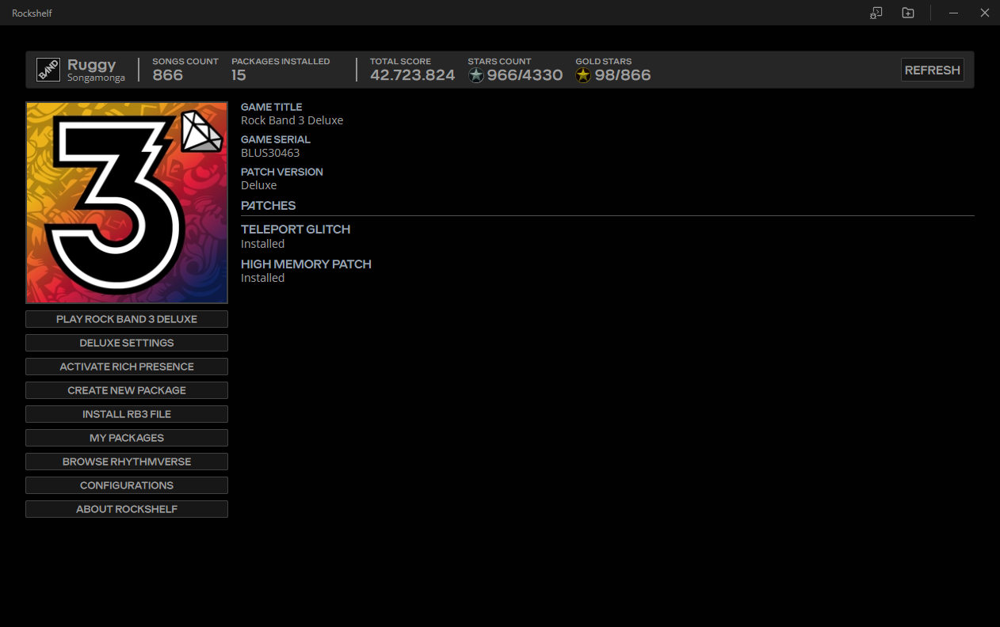

   

- [About](#about)
- [Requirements](#requirements)
  - [System](#system)
  - [Python](#python)
- [Special Thanks](#special-thanks)

# About

Rockshelf is a Rock Band 3 utility suite for RPCS3 users built with [Electron Vite](https://electron-vite.org/) framework. Rockshelf comes with a hand-made `core` package that features the main [NodeJS](https://nodejs.org/en) process and methods, as well as the Rockshelf preload script, and uses [ReactJS](https://react.dev/) as a renderer framework.

# Requirements

## System

- [FFMPEG](https://www.ffmpeg.org/).
  - The FFMPEG path must also be settled on the system environment variables.
- [Python v3](https://www.python.org/downloads/)

## Python

| Package name   | Install command            | Description                                                                         | PyPI link                                        |
| -------------- | -------------------------- | ----------------------------------------------------------------------------------- | ------------------------------------------------ |
| `audioop-lts`  | `pip install audioop-lts`  | LTS Port of Python `audioop`.                                                       | [[link]](https://pypi.org/project/audioop-lts/)  |
| `cryptography` | `pip install cryptography` | A package which provides cryptographic recipes and primitives to Python developers. | [[link]](https://pypi.org/project/cryptography/) |
| `mido`         | `pip install mido`         | MIDI Objects for Python.                                                            | [[link]](https://pypi.org/project/mido/)         |
| `puremagic`    | `pip install puremagic`    | Pure python implementation of magic file detection.                                 | [[link]](https://pypi.org/project/mido/)         |
| `pillow`       | `pip install pillow`       | Python Imaging Library (fork).                                                      | [[link]](https://pypi.org/project/pillow/)       |
| `pydub`        | `pip install pydub`        | Manipulate audio with an simple and easy high level interface.                      | [[link]](https://pypi.org/project/pydub/)        |

# Special Thanks

- [Carl Mylo](https://github.com/carlmylo): Helping testing and providing the spanish translation.
- [raphaelgoulart](https://github.com/raphaelgoulart)
- [TrojanNemo](https://github.com/trojannemo)
- [Jnack](https://github.com/jnackmclain)
- [Aloquendiar](https://github.com/Aloquendiar)
- [Emma](https://github.com/InvoxiPlayGames)
- [LocalH](https://github.com/LocalH)
- [Onyxite](https://github.com/mtolly)
