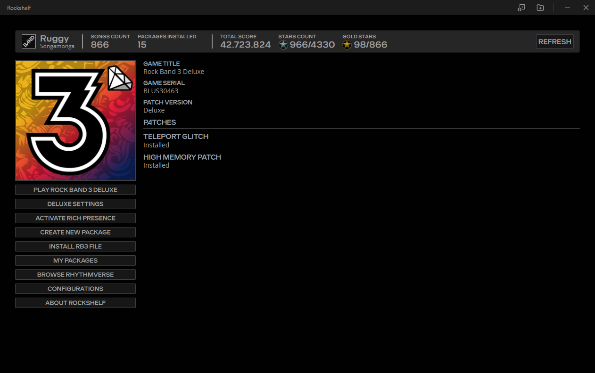

   

 
<h1>Table of Contents</h1>

- [About](#about)
  - [Features](#features)
- [Changelog](#changelog)
- [Requirements](#requirements)
  - [System](#system)
- [Known Limitations](#known-limitations)
- [Special Thanks](#special-thanks)

# About

Rockshelf is a Rock Band 3 song package manager for RPCS3 users built with [Electron Vite](https://electron-vite.org/) framework. Rockshelf comes with a hand-made `core` package that features the main [NodeJS](https://nodejs.org/en) process and methods, and uses [ReactJS](https://react.dev/) as a renderer framework.

Please, check the following documentations:

- Rockshelf Quick Tutorial
  - [English (USA)]()
  - [Portuguese (Brazil)]()
  - [Spanish (Latin America)]()
  - [French (Canada)]()
- [Rockshelf CLI](./docs/CLI.md)
- [Custom File Types (English only)](./docs/FILES.md)

## Features

- Rock Band 3 Launcher
  - _Starts Rock Band 3 on RPCS3 directly from Rockshelf._
- Deluxe Installer
  - _Rockshelf is able to install Deluxe and keep track of official latest commits automatically._
- Quick Configuration Setter
  - _Quickly use pre-defined configurations for Rock Band 3 on RPCS3._
- Discord Rich Presence
  - _Built-in localized Discord Rich Presence for Rock Band 3 Deluxe._
- Song Package Creator
  - _Create a new song package from CON and/or PKG files._
- Package Exporter and Installer
  - _Quickly export and share your packages as a [Rock Band 3 Song Package file](#rock-band-3-song-package-file), with support for package thumbnail, description, package author, and more!_
- Package Manager
  - _Visualize your installed packages' songs and data._
- Leaderboard Viewer
  - _Visalize a song's leaderboards from GoCentral directly on Rockshelf._
- Rhythmverse Browser
  - _Search for songs from Rhythmverse._
- CLI Application `NEW!`
  - Rockshelf exposes many internal methods on its command line interface API. See [CLI.md](./docs/CLI.md) for full documentation.

# Changelog

See the [CHANGELOG](./CHANGELOG.md) file for more details.

# Requirements

## System

- [FFMPEG](https://www.ffmpeg.org/).
  - The FFMPEG path must also be settled on the system environment variables.
- [Python v3](https://www.python.org/downloads/) (Tested on development and production using Python v3.14.2).

On Linux:

- [Wine](https://www.winehq.org/).

# Known Limitations

- **Rockshelf is not able to read, install or edit Rock Band/Rock Band 2 song packages (except any official song package from Rock Band).**
  - _Rockshelf uses a specific DTA parser written in JavaScript that can't process Rock Band/Rock Band 2 DTA values, and therefore can't guarantee compatibility with Rock Band/Rock Band 2. Rockshelf's DTA Parser was written to parse exclusively Rock Band 3 DTAs from customs generated by MAGMA, or DTAs from Rock Band 3 or newer._
- **Rockshelf is not able to install any official song package.**
  - _For official packages, installing the PKG version directly through RPCS3 is recommended. Rockshelf is only able to detect that they're official packages and lock all types of editing on them. Please, don't try to install the CON version of official packages, as it might collide with the same error discussed previously._
- **Rockshelf is not able to create or edit both CON and PKG files.**
  - _Both CON and PKG files are formats specific for their systems (Xbox 360 and PlayStation 3, respectively). Rockshelf uses the new [Rock Band 3 Song Package](#rock-band-3-song-package-file) file format as a native song package format for the application, with exclusive features for customizations!_

# Special Thanks

- [Carl Mylo](https://github.com/carlmylo): Helping testing and providing the spanish translation.
- [Ganso](https://github.com/Gansinhu): Helping with general testing.
- [TrojanNemo](https://github.com/trojannemo): Helping and providing the CliCrypt CLI.
- [Aloquendiar](https://github.com/Aloquendiar): Helping with general testing and helping providing the spanish translation.
- [MrBean](https://github.com/mrbean56): Helping with general testing and helping providing the canadian french translation.
- [LocalH](https://github.com/LocalH): Providing the Moggulator python script.
- [Emma](https://github.com/InvoxiPlayGames): General help and providing the Song ID generator logic.
- [raphaelgoulart](https://github.com/raphaelgoulart): General help and being a good friend.
- [Jnack](https://github.com/jnackmclain): General help and being a good friend.
- [Onyxite](https://github.com/mtolly): General help, being the creator of the Onyx toolkit.
